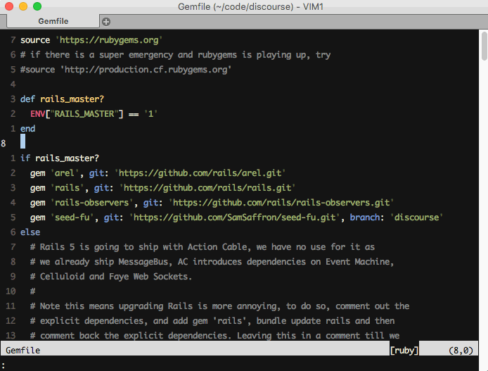

#VimDrawer

:point_right: When you work with some big tasks you may need edit too many files at once and most of the time you may get lost in so many files.

VimDrawer is Vim plugin to help you to work with many open files on Vim in a sane way.

##Usage

First, you must be familiar with [Vim buffers](http://joshldavis.com/2014/04/05/vim-tab-madness-buffers-vs-tabs/), if you are, the basic idea is to create **scoped buffer lists per tab** AND do a **file auto triage** to send your file to the correct tab based on the file type name. For now on I will call this tabs as "drawer".

To use you must define the schema of your drawers using a [Vim dict.](http://learnvimscriptthehardway.stevelosh.com/chapters/37.html) on the global variable `g:vim_drawer_spaces` on your vimfiles. The dict's key is the _drawer name_ and the dict's value is the **RegExp to match the file name if it should or not go to the drawer**. Example:

```viml
" ~/.vimrc
let g:vim_drawer_spaces = {
  \"model": "model",
  \"controller": "controller"
\}
```

In the example above every file that has `model` in the name goes to the tab named as **model**, your _models drawer_.



Any other file that hasn't the declared drawer destination goes to the current drawer.

:bulb: You can define drawers schema per project by adding in your project's root the `.vim-drawer.vim` file, on this file you put the `g:vim_drawer_spaces` dict.

To check what files are in the drawer you will need to invoke the command  `:VimDrawer`. This command will open a horizontal split with a list of the current buffers in the drawer. To open the buffer just press `enter`.

:bulb: You can map this command to a shortcut like:

```viml
nnoremap <C-Space> :VimDrawer<CR>
```
Now you can invoke the drawer's buffers selector pressing `Ctrl + Space`.

##Installation

You can install this plugin with Pathogen, Vundle and other plugin loaders.

##It's a experiment

:warning: :hand: This is a very experimental version, a PoC, therefore, It may cause bugs on your Vim, use this to help improve this idea if you want (feedback or code).

##Is it a [vim-ctrl-space](https://github.com/vim-ctrlspace) copycat?

This plugin is a simplified version of the awesome vim-ctrl-space plugin with the auto file triage feature (that I even had [shown to vim-ctrlspace folks](https://github.com/vim-ctrlspace/vim-ctrlspace/issues/177)). I decide to create a separate version mainly to implement the auto triage feature and because vim-ctrl-space IMHO could be much more simple at some aspects that I won't discourse here. Ping me on Twitter if you are interested.
